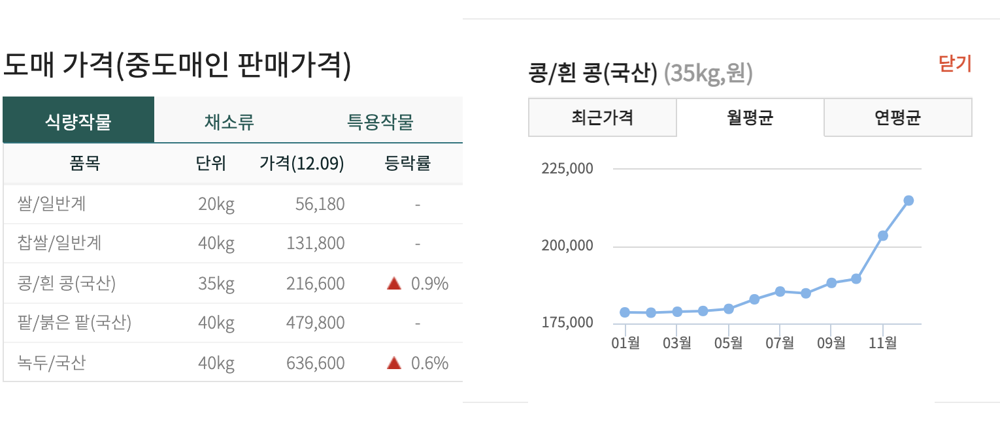

## 공공데이터 API와
## 리액트(타입스크립트)를 활용한
## 데이터 시각화

이수진 / sujinlee.me@gmail.com

---

실습 코드 : https://github.com/sujinleeme/ko-agriculture-market-prices-dashboard
질문 : http://bit.ly/39TxVpB

---
### 목차

1. 공공데이터 오픈 API 신청 및 승인받기
2. 데이터 요청 보내기 및 반환된 데이터 이해하기
3. create-react-app으로 리액트 앱 구성하기
4. 외부 데이터 요청 API 만들기 (axios)
5. 메뉴 네베게이션바 만들기 (material-ui)
6. 꺾은 선 그래프 그리기 (recharts)

---



[공공데이터 포털](data.go.kr) - [농수축산물 품목별 상세조사가격 서비스](https://www.data.go.kr/tcs/dss/selectApiDataDetailView.do?publicDataPk=15058698)
[KAMIS 농산물 유통정보](https://www.kamis.or.kr/) - [Open API](https://www.kamis.or.kr/customer/reference/openapi_list.do)

---

## 1. 공공데이터 오픈 API 신청 및 승인받기
공공데이터 포털에서 오픈 API를 신청하고 승인을 받고, 오픈 API 명세서를 읽어보자.

공공데이터 포털 : https://www.data.go.kr/

---
## 2. 데이터 요청 보내기 및 반환된 데이터 이해하기
Postman에서 REST API 요청을 보내보고 반환되는 데이터를 확인해보자.

Postman 다운로드 https://www.postman.com/downloads/

---

## 인증키가 오류일 경우?
`SERVICE_KEY_IS_NOT_REGISTERED_ERROR`

```
{주소}?ServiceKey={인증키}
```

* 승인 완료 후 1시간이 지났는지
* 파라미터가 ServiceKey인지 serviceKey인지
* 인증키가 이미 인코딩이 되어 있는 경우라면, 디코딩이 필요


---


### 활용 데이터
전국에서 거래되는 주요 농산물, 수산물, 축산물에 대한 도소매 가격
1. [공공데이터 포털](data.go.kr) - [농수축산물 품목별 상세조사가격 서비스](https://www.data.go.kr/tcs/dss/selectApiDataDetailView.do?publicDataPk=15058698)

2. [KAMIS 농산물 유통정보](https://www.kamis.or.kr/) - [Open API](https://www.kamis.or.kr/customer/reference/openapi_list.do)

---

### XML vs JSON?
자바스크립트 기반의 웹 서비스라면, JSON을 사용하자.

---

#### XML
```
<items>
    <item>
        <areaCode>1102</areaCode>
        <areaNm>서울서부</areaNm>
        <examinDe>20150502</examinDe>
        <examinGradCode>1</examinGradCode>
        ....
    </item>
    <item>
    ....
```

---

#### JSON
```
{
  "item": {
    "areaCode": "1102",
    "areaNm": "서울서부",
    "examinDe": "20150502",
    "examinGradCode": "1",
    "#text": "
        ....
    "
  }
}
```

---
### JSON의 이점
* JSON 구조가 XML보다 직관적
* 어떤 프로그래밍 언어를 사용하든 쉽게 읽고 객체에 직접 매핑이 가능하다.
* JSON 데이터 모델의 구조가 곧 사용할 애플리케이션(자바스크립트)과 데이터와 일치하므로 빠른 개발이 가능
* JSON은 XMl보다 속도가 빠르며, 데이터 상호교환, 파싱, 인코딩 등 더 편리함

---
### Open API 데이터 특징 분석

1. [공공데이터 포털](data.go.kr) - [농수축산물 품목별 상세조사가격 서비스](https://www.data.go.kr/tcs/dss/selectApiDataDetailView.do?publicDataPk=15058698)

*  JSON 포맷으로 반환하지 않기 때문에 XML에서 JSON으로 변환 필요
*  당일 기준 가격만 조회 가능
* 전체 키 목록(예: 품목 및 등급 등)을 제공하지 않기 떄문에 별도로 아래 [3. 농축수산물 품목 및 등급 코드표] 정보를 활용 해야함.

----

요청 URL: `http://apis.data.go.kr/B552895/openapi/service/OrgPriceExaminService/getExaminPriceList?ServiceKey={서비스키}&pageNo=1&numOfRows=10&examinDe=20150502&examinCd=6&prdlstCd=221&examinMrktCode=서가락동도매시장`

```
<items>
    <item>
        <areaCode>1102</areaCode>
        <areaNm>서울서부</areaNm>
        <examinDe>20150502</examinDe>
        <examinGradCode>1</examinGradCode>
        <examinGradNm>상(1등급)</examinGradNm>
        <examinMrktCode>110211</examinMrktCode>
        <examinMrktNm>서울가락동도매시장</examinMrktNm>
        <examinNm>도매가격</examinNm>
        <examinPrdlstCode>221</examinPrdlstCode>
        <examinPrdlstNm>수박</examinPrdlstNm>
        <examinSeCode>6</examinSeCode>
        <examinSpciesCode>00</examinSpciesCode>
        <examinSpciesNm>일반</examinSpciesNm>
        <examinUnitNm>1개</examinUnitNm>
        <flctsCode>00</flctsCode>
        <rnum>1</rnum>
        ....
    </item>
    <item>
    ....
```
----

2. [KAMIS 농산물 유통정보](https://www.kamis.or.kr/) - [Open API](https://www.kamis.or.kr/customer/reference/openapi_list.do)

* KAMIS 사이트 개발을 위해 가존 농수축산물 품목별 상세조사가격 정보를 재가공한 API로 보여짐
* 일별(1일전, 1주일전 등, 월별,연도별 등 기간별 가격 조회 가능)
* 전체 키 목록(예: 품목 및 등급 등)을 제공하지 않기 떄문에 별도로 아래 [농축수산물 품목 및 등급 코드표] 정보를 활용 해야함.

---

3. [KAMIS 농산물 유통정보](https://www.kamis.or.kr/) - [농축수산물 품목 및 등급 코드표](https://www.kamis.or.kr/customer/circulation/other/other.do?action=detail&brdctsno=430442&pagenum=1&search_option=&search_keyword=&)
* csv이므로 JSON으로 재가공해야 함

---
요청 URL:

`http://www.kamis.or.kr/service/price/xml.do?action=dailyPriceByCategoryList&p_product_cls_code=02&p_country_code=1101&p_regday=2015-10-01&p_convert_kg_yn=N&p_item_category_code=200&p_cert_key={인증키}&p_cert_id=222&p_returntype=json
`

```json
"data": {
  "error_code": "000",
  "item": [
    {
        "item_name": "배추",
        "item_code": "211",
        "kind_name": "고랭지(10kg)",
        "kind_code": "02",
        "rank": "상품",
        "rank_code": "04",
        "unit": "10kg",
        "day1": "당일 (10/01)",
        "dpr1": "5,500",
        "day2": "1일전 (09/30)",
        "dpr2": "7,000",
        "day3": "1주일전 (09/24)",
        "dpr3": "7,000",
        "day4": "2주일전 (09/17)",
        "dpr4": "6,500",
        "day5": "1개월전",
        "dpr5": "5,900",
        "day6": "1년전",
        "dpr6": "7,140",
        "day7": "일평년",
        "dpr7": "10,080"
    },
```

---

## 3. create-react-app으로 리액트 앱 구성하기


---
## 3. create-react-app으로 리액트 앱 구성하기

추천 온라인 무료 튜토리얼 : [The road to learn React (더 로드 투 더 런 리액트)](https://leanpub.com/the-road-to-learn-react-korean)

---
### 왜 타입스크립트와 리액트인가?

타입스크립트는 자바스크립트 코드를 더 빠르게  실행할 수 있으며 자바스크립트 코드에 비해 런타임 오류 발생 가능성이 낮고 브라우저나 자바스크립트 엔진 사양에서 생산성 높은 애플리케이션을 개발할 수 있다.
http://bit.ly/2IyVNlj

리액트는 현재 가장 인기 있는 Single Page Application 라이브러리!

---
### 설치방법

설치 방법 - [installation.md](github.com/sujinleeme/ko-agriculture-market-prices-dashboard/tutorial/installation.md)

---

### 4. 외부 데이터 요청 API 만들기 (axios)

axios 설치하기

```
yarn add axios
yarn add -D @types/axios
```
---

App.tsx

```tsx
const API_URL = "http://www.kamis.or.kr/service/price/xml.do?action=dailyPriceByCategoryList&p_product_cls_code=02&p_country_code=1101&p_regday=2020-10-02&p_convert_kg_yn=N&p_item_category_code=200&p_cert_key=111&p_cert_id=222&p_returntype=json"

function App() {
  const getProducts = () =>
    axios
      .get(API_URL, {
        headers: {
          'Access-Control-Allow-Origin': '*',
          'Access-Control-Allow-Credentials': true,
        },
      })
      .then((response) => console.log(response));

  useEffect(() => {
    getProducts();
  }, []);
```


---
## CORS 에러가 발생! 왜?

Access to XMLHttpRequest at '(URL)' has been blocked by CORS policy: Response to preflight request doesn't pass access control check: No 'Access-Control-Allow-Origin' header is present on the requested resource.

## 해결방법
cors 이슈로 서버와 다른 도메인이 데이터를 요청하기 때문에 발생하는 에러

공공데이터 서버에서 공공데이터를 사용할 사람이 보유한 서버에 데이터를 보내고 그 서버에 'Access-Control-Allow-Origin' 헤더를 추가해야 함

-> 서버를 만들자

---

## Node와 express로 간단한 서버 구축하기

새로 프로젝트 폴더를 만들고, 새로 서버용 디렉토리 server 생성 (이후 my-app도 해당 디렉토리로 옮기기)

```
yarn init   
yarn add -D express
yarn add axios
```
---

`server/server.js`

```js
const express = require("express");
const axios = require("axios");
const app = express();

const currentPut = async () => {
  let response;
  try {
    response = await axios.get(
      "http://www.kamis.or.kr/service/price/xml.do?action=dailyPriceByCategoryList&p_product_cls_code=02&p_country_code=1101&p_regday=2020-10-02&p_convert_kg_yn=N&p_item_category_code=200&p_cert_key=111&p_cert_id=222&p_returntype=json"
    );
  } catch (e) {
    console.log(e);
  }
  return response;
};

app.listen(8080, () => {
  console.log("Server is running at: http://localhost:8080/");
});

---
app.get("/", (req, res) => {
  currentPut().then((response) => {
    res.setHeader("Access-Control-Allow-Origin", "*");
    if (response.data.data.error_code === '000') {
      res.json(response.data.data);
    }
    else {
      res.json({error_code: response.data.data.error_code, error_message: "error"})
    }
  });
});

app.listen(8080, () => {
  console.log("Server is running at: http://localhost:8080/");
});
```
---
`my-app/src/App.tsx`

```tsx
const API_URL = 'http://localhost:8080/';

function App() {
    const [products, setProducts] = useState([]);
    const getProducts = () => axios.get(API_URL).then((response) => console.log(response));
    useEffect(() => {
        getProducts();
  }, []);
```

콘솔에 결과 확인해보기

---
## 타입 추가하기

```tsx
interface Product {
  item_name: string;
}

function App() {
  const [products, setProducts] = useState<Product[]>([]);
  const getProducts = () =>
    axios
      .get(API_URL)
      .then((response) => response.data.item)
      .then((data) => setProducts(data));

  useEffect(() => {
    getProducts();
  }, []);
```
---

### 5. 메뉴 네베게이션바 만들기 (material-ui)

```
yarn add  @material-ui/core
```

---

### 6. 꺾은 선 그래프 그리기 (recharts)

```
yarn add @recharts
yarn add -D @types/recharts
```

---

## 공공데이터 API와
## 리액트(타입스크립트)를 활용한
## 데이터 시각화

이수진 / sujinlee.me@gmail.com

---

실습 코드 : https://github.com/sujinleeme/ko-agriculture-market-prices-dashboard
질문 : http://bit.ly/39TxVpB

---

감사합니다.